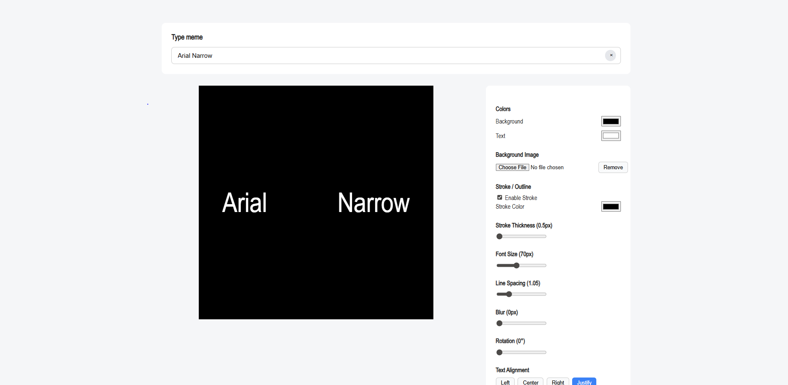

# 🌌 Arial Justify Text Generator

Create your own style text on image in seconds.

This is a simple web-based text text image generator that allows users to customize text and export it as a high-resolution PNG image.

---

## 🚀 Live Demo

👉 https://yogeshjakka.github.io/Arial.justify/

---

## 🖼 Preview



---

## ✨ Features

- Real-time text editing
- Background image upload
- Custom background color
- Custom text color
- enable stroke(also can adjust stroke thickness)
- Adjustable font size
- Adjustable line spacing
- Blur effect
- Rotation control
- Text alignment (Left, Center, Right, Justify)
- Horizontal & Vertical flip
- High-resolution PNG export (2x scale)
- Fully client-side (no backend required)

---

## 🛠 Tech Stack

- HTML5
- CSS3
- Vanilla JavaScript
- [html2canvas](https://cdnjs.cloudflare.com/ajax/libs/html2canvas/1.4.1/html2canvas.min.js)

---

## 📂 Project Structure

```
Arial Justify/
│
├── index.html
├── style.css
├── script.js
└── README.md
└── fonts
```

---

## ⚙ How to Run Locally

1. Clone the repository:

```
git clone https://github.com/yogeshjakka/Arial.justify.git
```

2. Open `index.html` in your browser.

No installations required.

---

## 🌍 Deployment

This project can be deployed easily using:

- GitHub Pages
- Netlify
- Vercel
- Any static hosting platform

---

## 🎯 Purpose

This tool was built as a lightweight meme-style image generator and creative branding utility.

---

## 📜 License

This project is open for personal use.
